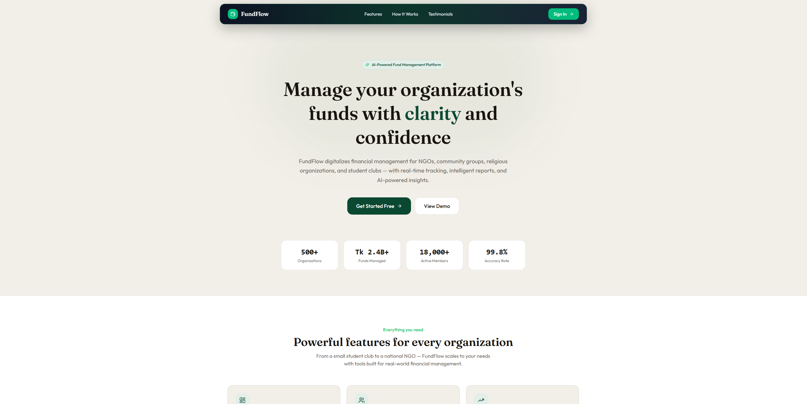
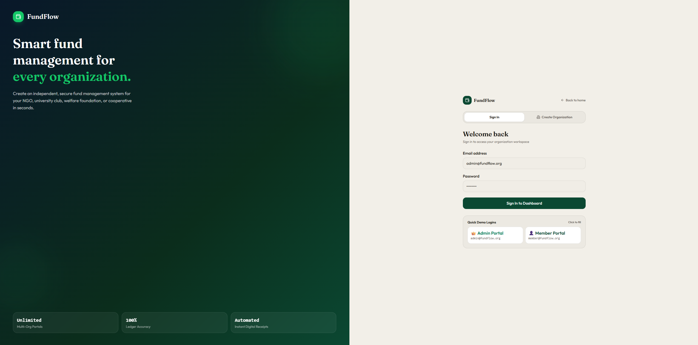
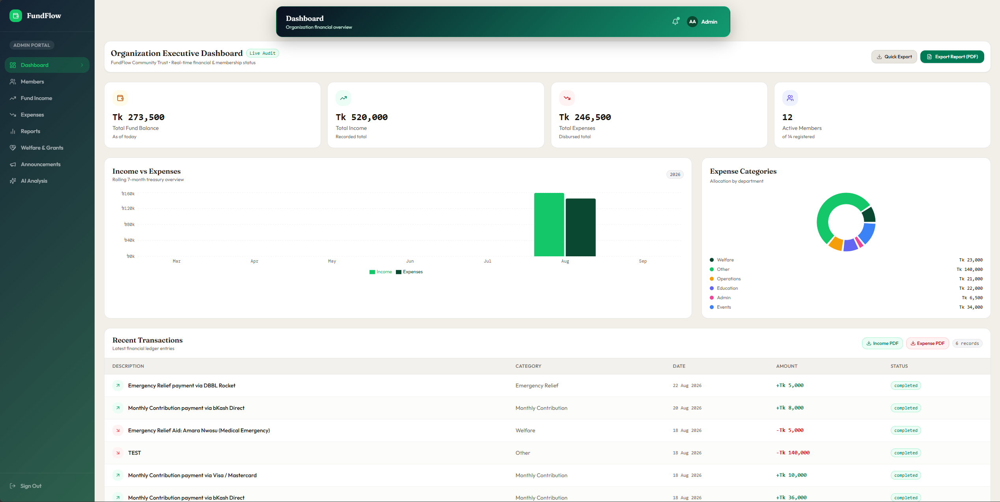
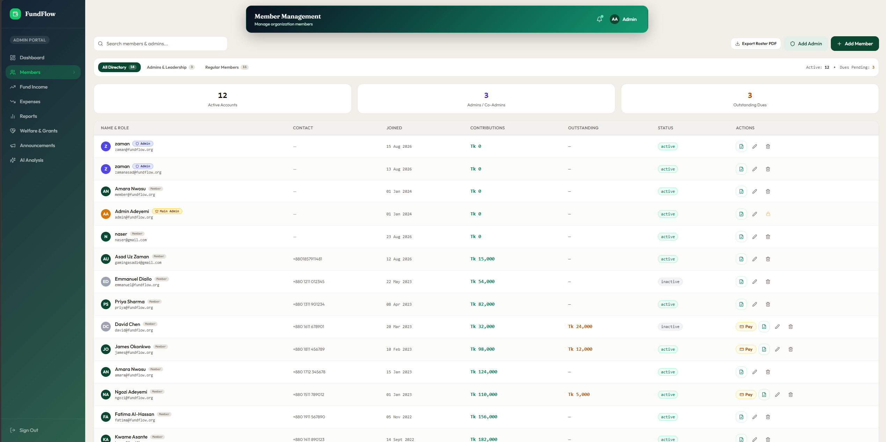
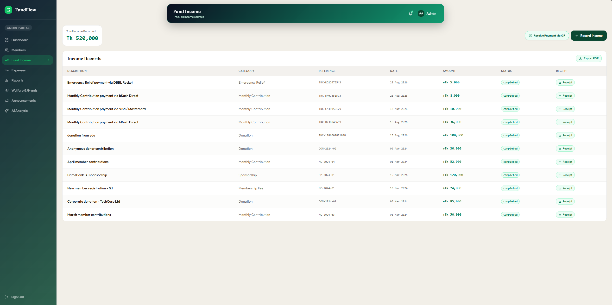
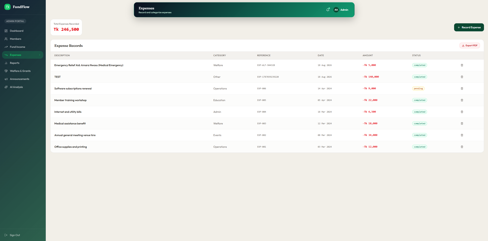
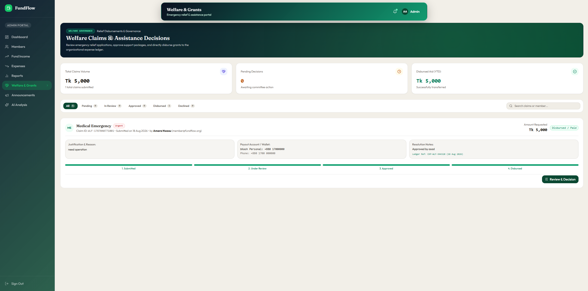
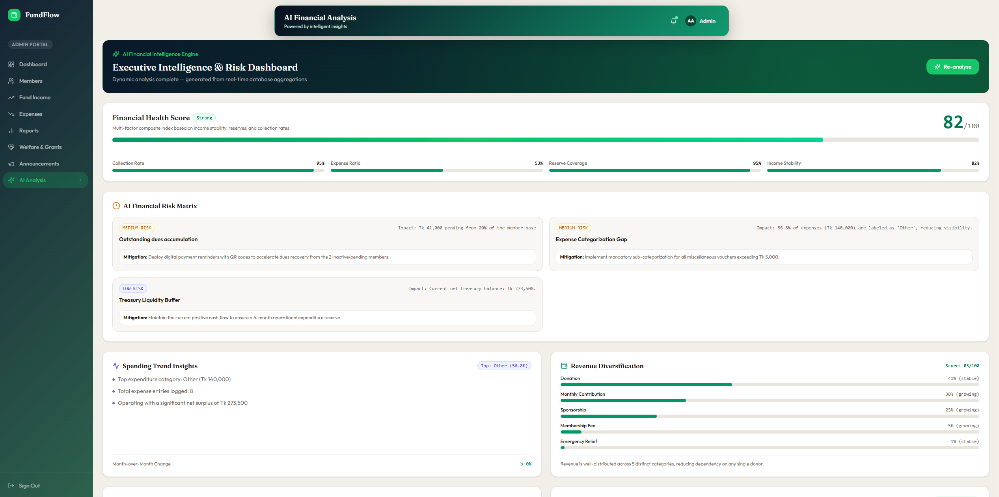
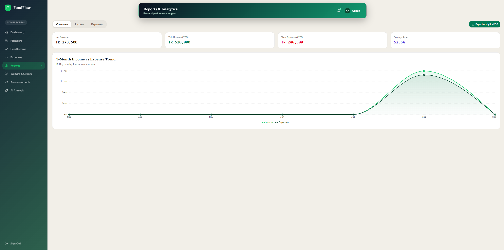
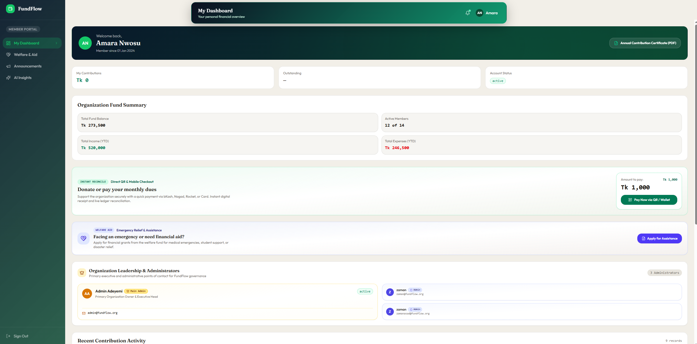

# 💰 FundFlow — Smart Fund Management System

A comprehensive, full-stack web application for managing community, organizational, and cooperative fund operations. FundFlow provides real-time financial tracking, member management, welfare disbursement workflows, AI-powered analytics, and PDF report generation — all within a modern, responsive interface.

> **Live Demo:** [(https://fundflow-web-dev-project.vercel.app/)](https://fundflow-web-dev-project.vercel.app/)

---

## 📑 Table of Contents

- [System Design](#-system-design)
- [Technology Stack](#-technology-stack)
- [Database Design](#-database-design)
- [User Interface](#-user-interface)
- [Features](#-features)
- [Project Structure](#-project-structure)
- [API Endpoints](#-api-endpoints)
- [Getting Started](#-getting-started)
- [Environment Variables](#-environment-variables)
- [Deployment](#-deployment)
- [Contributors](#-contributors)
- [License](#-license)

---

## 🏗 System Design

### Architecture Overview

FundFlow follows a **client-server architecture** with a clear separation between the frontend (React SPA) and the backend (Vercel Serverless Functions). The system uses **JWT-based authentication** and communicates exclusively over RESTful JSON APIs.

```
┌──────────────────────────────────────────────────────────────┐
│                        CLIENT (Browser)                      │
│  ┌─────────────────────────────────────────────────────────┐ │
│  │  React 18 SPA + TailwindCSS + Recharts + MUI + Motion  │ │
│  │  ┌──────────┐ ┌──────────┐ ┌──────────┐ ┌───────────┐  │ │
│  │  │Dashboard │ │ Members  │ │  Income  │ │ Expenses  │  │ │
│  │  ├──────────┤ ├──────────┤ ├──────────┤ ├───────────┤  │ │
│  │  │ Reports  │ │Announce. │ │ Welfare  │ │AI Analysis│  │ │
│  │  └──────────┘ └──────────┘ └──────────┘ └───────────┘  │ │
│  └───────────────────────┬─────────────────────────────────┘ │
│                          │ REST API (JSON)                    │
└──────────────────────────┼───────────────────────────────────┘
                           │
┌──────────────────────────┼───────────────────────────────────┐
│                   SERVER (Vercel Serverless)                  │
│  ┌───────────────────────┴─────────────────────────────────┐ │
│  │              API Routes (/api/*)                        │ │
│  │  ┌────────┐ ┌──────────┐ ┌────────────┐ ┌───────────┐  │ │
│  │  │ login  │ │ register │ │transactions│ │  members  │  │ │
│  │  ├────────┤ ├──────────┤ ├────────────┤ ├───────────┤  │ │
│  │  │summary │ │announce. │ │  welfare   │ │ analysis  │  │ │
│  │  └────────┘ └──────────┘ └────────────┘ └───────────┘  │ │
│  └───────────────────────┬─────────────────────────────────┘ │
│                          │                                    │
│  ┌───────────────┐ ┌─────┴──────┐ ┌─────────────────────┐   │
│  │ Auth (JWT)    │ │  MongoDB   │ │ AI (Gemini/OpenAI)  │   │
│  │ + bcrypt      │ │  Atlas     │ │ External APIs       │   │
│  └───────────────┘ └────────────┘ └─────────────────────┘   │
└──────────────────────────────────────────────────────────────┘
```


### Data Flow

1. **Authentication Flow:** User submits credentials → Server verifies against MongoDB (bcrypt) → JWT token issued → Client stores token in `sessionStorage` + `localStorage` → Subsequent requests include `Authorization: Bearer <token>` header.
2. **Transaction Flow:** Admin/Member creates a transaction → Server validates payload → Inserts into `transactions` collection → If income, reconciles member `contributions` and `outstanding` balances automatically.
3. **Welfare Flow:** Member submits a welfare request → Admin reviews (under_review) → Admin approves with amount → Admin disburses → System auto-creates an expense transaction in the ledger.
4. **AI Analysis Flow:** User requests analysis → Server aggregates financial data from MongoDB → Constructs prompt → Sends to Gemini/OpenAI API → Parses JSON response → Returns structured insights to client.

---

## 🛠 Technology Stack

### Frontend

| Technology | Version | Purpose |
|---|---|---|
| **React** | 18.3.1 | Core UI library (SPA) |
| **TypeScript** | 7.0.2 | Type-safe JavaScript |
| **Vite** | 6.4.3 | Build tool & dev server |
| **TailwindCSS** | 4.1.12 | Utility-first CSS framework |
| **Material UI (MUI)** | 7.3.5 | UI component library |
| **Radix UI** | Various | Accessible headless components |
| **Recharts** | 2.15.2 | Data visualization & charts |
| **Motion (Framer Motion)** | 12.23.24 | Animations & transitions |
| **Lucide React** | 0.487.0 | Icon library |
| **jsPDF + AutoTable** | 4.2.1 / 5.0.8 | Client-side PDF generation |
| **React Hook Form** | 7.55.0 | Form state management |
| **React Router** | 7.18.2 | Client-side routing |
| **date-fns** | 3.6.0 | Date formatting utilities |

### Backend

| Technology | Version | Purpose |
|---|---|---|
| **Node.js** | — | Server runtime |
| **Vercel Serverless Functions** | — | API route hosting |
| **MongoDB** (Driver) | 6.21.0 | NoSQL database driver |
| **MongoDB Atlas** | — | Cloud-hosted database |
| **JSON Web Token (jsonwebtoken)** | 9.0.3 | Authentication tokens |
| **bcryptjs** | 3.0.3 | Password hashing |
| **Gemini API** | — | AI-powered financial analysis |
| **OpenAI API** | — | Alternative AI analysis provider |

### DevOps & Tooling

| Technology | Purpose |
|---|---|
| **Vercel** | Hosting & deployment platform |
| **Git / GitHub** | Version control |
| **ESLint** | Code linting |
| **PostCSS** | CSS processing |

---

## 🗄 Database Design

FundFlow uses **MongoDB Atlas** (NoSQL document database). The database name is `smartfund` and contains the following collections:

### Collections Schema

#### 1. `organizations`

| Field | Type | Description |
|---|---|---|
| `id` | String | Unique org identifier (e.g., `org_1725600000000`) |
| `name` | String | Organization display name |
| `slug` | String | URL-safe slug |
| `ownerEmail` | String | Email of the founding admin |
| `phone` | String | Contact phone number |
| `currency` | String | Currency code (default: `BDT`) |
| `createdAt` | String | ISO date of creation |
| `status` | String | `active` / `inactive` |

#### 2. `users`

| Field | Type | Description |
|---|---|---|
| `id` | String | Unique user identifier |
| `orgId` | String | Reference to `organizations.id` |
| `orgName` | String | Denormalized organization name |
| `email` | String | Unique login email |
| `password` | String | bcrypt-hashed password |
| `name` | String | Full name |
| `role` | String | `admin` or `member` |
| `phone` | String | Phone number |
| `createdAt` | String | Registration date |
| `createdBy` | String | Email of admin who created this account (null for org owner) |

#### 3. `members`

| Field | Type | Description |
|---|---|---|
| `id` | String | Unique member identifier |
| `orgId` | String | Reference to `organizations.id` |
| `name` | String | Full name |
| `email` | String | Email address |
| `role` | String | `admin` or `member` |
| `isMainAdmin` | Boolean | Whether this is the founding/main admin |
| `adminType` | String | `main_admin` / `admin` / `undefined` |
| `initials` | String | 2-letter initials for avatar |
| `joined` | String | Date joined |
| `status` | String | `active` / `inactive` |
| `contributions` | Number | Total amount contributed (Tk) |
| `outstanding` | Number | Outstanding dues (Tk) |
| `phone` | String | Phone number |

#### 4. `transactions`

| Field | Type | Description |
|---|---|---|
| `id` | String | Unique transaction identifier |
| `orgId` | String | Reference to `organizations.id` |
| `type` | String | `income` or `expense` |
| `category` | String | Category (e.g., Monthly Contribution, Welfare, Operations) |
| `amount` | Number | Transaction amount in Tk |
| `description` | String | Description of the transaction |
| `date` | String | Transaction date |
| `reference` | String | Reference code (e.g., `TRX-1725600000000`) |
| `status` | String | `completed` or `pending` |
| `memberId` | String | Associated member ID (optional) |
| `memberEmail` | String | Associated member email (optional) |
| `memberName` | String | Associated member name (optional) |

#### 5. `announcements`

| Field | Type | Description |
|---|---|---|
| `id` | String | Unique announcement identifier |
| `orgId` | String | Reference to `organizations.id` |
| `title` | String | Announcement title |
| `body` | String | Full announcement text |
| `date` | String | Publication date |
| `priority` | String | `high` / `medium` / `low` |
| `author` | String | Author name or department |

#### 6. `welfare_requests`

| Field | Type | Description |
|---|---|---|
| `id` | String | Unique welfare request ID (e.g., `WLF-1725600000000`) |
| `orgId` | String | Reference to `organizations.id` |
| `memberId` | String | Requesting member's ID |
| `memberName` | String | Requesting member's name |
| `memberEmail` | String | Requesting member's email |
| `memberPhone` | String | Requesting member's phone |
| `category` | String | Medical Emergency / Education Grant / Disaster Relief / Family Welfare / Community Project / Other |
| `amountRequested` | Number | Amount requested (Tk) |
| `amountApproved` | Number | Amount approved by admin (Tk) |
| `urgency` | String | `urgent` / `high` / `medium` / `low` |
| `reason` | String | Justification for the request |
| `bankOrWalletDetails` | String | Payment details for disbursement |
| `date` | String | Request submission date |
| `status` | String | `pending` / `under_review` / `approved` / `disbursed` / `rejected` |
| `adminNote` | String | Admin's review notes |
| `disbursedDate` | String | Date funds were disbursed |
| `disbursedTxId` | String | Reference to auto-created expense transaction |
| `createdAt` | String | ISO timestamp of creation |

---

## 🎨 User Interface

FundFlow provides a modern, responsive UI with role-based views:

### Screenshots


| Screen | Description |
|---|---|
|  | **Landing Page** — Hero section with feature highlights and call-to-action buttons |
|  | **Login Page** — Secure authentication form with organization registration option |
|  | **Admin Dashboard** — Summary cards, area/bar/pie charts, recent transactions, and quick actions |
|  | **Members Management** — Full CRUD with search, role badges, contribution tracking |
|  | **Income Tracker** — Income transactions list, add/edit forms, category filters |
|  | **Expense Tracker** — Expense transactions with totals and reference codes |
|  | **Welfare Management** — Request submission, status pipeline (Pending → Review → Approved → Disbursed) |
|  | **AI Analysis** — Gemini/OpenAI-powered financial insights, trend analysis, risk assessment |
|  | **Reports** — PDF export for organization summary, income, expenses, and member reports |
|  | **Member Portal** — Personal dashboard, contribution history, payment modal |


### UI Features

- **Responsive Design:** Fully responsive layout with mobile hamburger menu
- **Dark/Light Theme Support:** Built-in theme switching via `next-themes`
- **Interactive Charts:** Area charts, bar charts, and pie charts using Recharts
- **Smooth Animations:** Page transitions and micro-interactions via Motion (Framer Motion)
- **Glassmorphism & Gradients:** Modern card designs with glass effect and gradient accents
- **Payment Modal:** Integrated payment flow with QR code generation
- **PDF Export:** Client-side PDF generation for receipts, certificates, and reports
- **Toast Notifications:** Real-time feedback using Sonner toast library
- **Confetti Effects:** Celebration animations for successful actions using canvas-confetti

---

## ✨ Features

### Admin Features
- 📊 **Dashboard** — Real-time fund summary with visual analytics (income vs expenses, category breakdown)
- 👥 **Member Management** — Add, edit, delete members; promote to admin; track contributions & dues
- 💵 **Income Tracking** — Record and categorize income (contributions, donations, sponsorships, fees)
- 💸 **Expense Tracking** — Record and categorize expenses (operations, welfare, events, admin)
- 📢 **Announcements** — Create priority-tagged announcements for all members
- 🤝 **Welfare Management** — Review, approve, reject, and disburse welfare requests
- 🤖 **AI Analysis** — Get AI-powered financial insights via Gemini or OpenAI
- 📄 **PDF Reports** — Export organization summary, income, expense, and member reports
- 🔐 **User Account Management** — Create admin/member accounts with secure password hashing

### Member Features
- 🏠 **Personal Dashboard** — View contribution history and outstanding balances
- 💳 **Make Payments** — Interactive payment modal with multiple payment methods
- 🤝 **Submit Welfare Requests** — Apply for emergency financial assistance
- 📢 **View Announcements** — Stay updated with organization news
- 🤖 **AI Analysis** — Personal financial insights and recommendations
- 🧾 **Download Receipts** — Export payment receipts and contribution certificates as PDFs

### Security
- 🔒 JWT-based authentication with 7-day expiry
- 🔑 bcrypt password hashing (cost factor 10)
- 🛡 Role-based access control (Admin vs Member)
- 🚫 Input validation on both client and server
- 🔐 Tab-isolated session management (sessionStorage + localStorage fallback)

---

## 📁 Project Structure

```
Smart Fund Management System/
├── api/                          # Vercel Serverless Functions (Backend)
│   ├── login.js                  # POST /api/login — User authentication
│   ├── register.js               # POST /api/register — Create user (admin-only)
│   ├── register-org.js           # POST /api/register-org — Register new organization
│   ├── members.js                # GET/POST/PUT/DELETE /api/members
│   ├── transactions.js           # GET/POST/DELETE /api/transactions
│   ├── announcements.js          # GET/POST /api/announcements
│   ├── welfare-requests.js       # GET/POST/PUT/DELETE /api/welfare-requests
│   ├── summary.js                # GET /api/summary — Dashboard aggregates
│   ├── analysis.js               # POST /api/analysis — AI financial analysis
│   ├── health.js                 # GET /api/health — Health check
│   ├── seed.js                   # POST /api/seed — Database seeder (dev only)
│   └── seed-admin.js             # POST /api/seed-admin — Admin account seeder
│
├── lib/                          # Shared Backend Libraries
│   ├── db.js                     # MongoDB connection (singleton pattern)
│   ├── auth.js                   # JWT sign/verify & auth middleware
│   ├── validation.js             # Input validation functions
│   └── validation.d.ts           # TypeScript declarations for validation
│
├── src/                          # Frontend Source Code
│   ├── main.tsx                  # React entry point
│   ├── vite-env.d.ts             # Vite type declarations
│   ├── styles/                   # Global CSS styles
│   └── app/
│       ├── App.tsx               # Main application (all views & routing)
│       ├── api.ts                # API client helper (fetch wrapper + auth)
│       ├── types.ts              # TypeScript type definitions
│       ├── components/
│       │   ├── PaymentModal.tsx   # Payment flow modal component
│       │   ├── ErrorBoundary.tsx  # React error boundary
│       │   └── shared.tsx        # Shared/reusable UI components
│       └── utils/
│           └── pdfExport.ts      # PDF generation utilities
│
├── diagrams/                     # Manually created diagrams (NOT AI-generated)
│   ├── er-diagram.png            # Entity-Relationship diagram
│   └── use-case-diagram.png      # Use-Case diagram
│
├── screenshots/                  # Application screenshots
│   └── ...                       # (Add screenshots here)
│
├── index.html                    # HTML entry point
├── vite.config.ts                # Vite configuration with API dev server
├── tsconfig.json                 # TypeScript configuration
├── postcss.config.mjs            # PostCSS configuration
├── vercel.json                   # Vercel deployment configuration
├── package.json                  # Dependencies and scripts
├── .env.example                  # Environment variable template
├── .gitignore                    # Git ignore rules
└── ATTRIBUTIONS.md               # Third-party attributions
```

---

## 🔌 API Endpoints

| Method | Endpoint | Auth | Description |
|---|---|---|---|
| `POST` | `/api/login` | ❌ | Authenticate user, returns JWT token |
| `POST` | `/api/register` | 🔐 Admin | Create a new user account |
| `POST` | `/api/register-org` | ❌ | Register a new organization + admin |
| `GET` | `/api/members` | 🔐 | List all members in the organization |
| `POST` | `/api/members` | 🔐 | Add or update a member |
| `PUT` | `/api/members` | 🔐 | Update member details |
| `DELETE` | `/api/members` | 🔐 | Remove a member |
| `GET` | `/api/transactions` | 🔐 | List all transactions |
| `POST` | `/api/transactions` | 🔐 | Record a new transaction |
| `DELETE` | `/api/transactions` | 🔐 | Delete a transaction |
| `GET` | `/api/announcements` | 🔐 | List all announcements |
| `POST` | `/api/announcements` | 🔐 | Create a new announcement |
| `GET` | `/api/welfare-requests` | 🔐 | List welfare requests (scoped by role) |
| `POST` | `/api/welfare-requests` | 🔐 | Submit a welfare request |
| `PUT` | `/api/welfare-requests` | 🔐 | Update status/notes/approval |
| `DELETE` | `/api/welfare-requests` | 🔐 | Delete/cancel a welfare request |
| `GET` | `/api/summary` | 🔐 | Dashboard aggregated statistics |
| `POST` | `/api/analysis` | 🔐 | AI-powered financial analysis |
| `GET` | `/api/health` | ❌ | Server health check |

---

## 🚀 Getting Started

### Prerequisites

- **Node.js** (v18 or higher)
- **npm** or **pnpm**
- **MongoDB Atlas** account (or local MongoDB instance)
- **Gemini API key** or **OpenAI API key** (for AI analysis feature)

### Installation

1. **Clone the repository:**

   ```bash
   git clone https://github.com/<your-username>/smart-fund-management-system.git
   cd smart-fund-management-system
   ```

2. **Install dependencies:**

   ```bash
   npm install
   ```

3. **Configure environment variables:**

   ```bash
   cp .env.example .env
   ```

   Edit `.env` with your credentials (see [Environment Variables](#-environment-variables)).

4. **Run the development server:**

   ```bash
   npm run dev
   ```

   The app will be available at `http://localhost:5173`. The Vite dev server includes a custom API middleware that serves the `/api/*` routes locally.

5. **Seed the database (optional):**

   Set `ALLOW_SEED=true` in your `.env`, then send a POST request to `/api/seed` to populate the database with sample data.

   Default demo credentials after seeding:
   - **Admin:** `admin@fundflow.org` / `admin123`
   - **Member:** `member@fundflow.org` / `member123`

---

## 🔑 Environment Variables

Copy `.env.example` to `.env` and configure:

| Variable | Required | Description |
|---|---|---|
| `MONGODB_URI` | ✅ | MongoDB Atlas connection string |
| `JWT_SECRET` | ✅ | Secret key for JWT token signing |
| `GEMINI_API_KEY` | ⚡ | Google Gemini API key (for AI analysis) |
| `GEMINI_API_URL` | ❌ | Custom Gemini API endpoint (default provided) |
| `OPENAI_API_KEY` | ⚡ | OpenAI API key (alternative to Gemini) |
| `OPENAI_MODEL` | ❌ | OpenAI model name (default: `gpt-4o-mini`) |
| `ALLOW_SEED` | ❌ | Set to `true` to enable database seeding |

> ⚡ At least one of `GEMINI_API_KEY` or `OPENAI_API_KEY` is required for the AI analysis feature.

---

## 🌐 Deployment

### Vercel (Recommended)

1. Push your code to GitHub.
2. Import the repository on [Vercel](https://vercel.com).
3. Set environment variables in the Vercel project settings.
4. Deploy — Vercel auto-detects Vite and serves the `api/` directory as serverless functions.

### Build Commands

```bash
# Build for production
npm run build

# Preview production build locally
npm run preview
```

---

## 👥 Contributors

| # | Name | Role | ID |
|---|---|---|---|
| 1 | ASAD UZ ZAMAN | Project Lead,Backend Developer | 242002712|
| 2 | Mohammad Fahim | Backend | 242002112 |
| 3 | Junaid Siddique | Frontend  | 242002212 |
| 4 | Tareque Aziz | Frontend | 242008412 |
| 5 | Shihab bin Faruq | Frontend | 242011212 |

---

## 📄 License

This project is developed as an academic/course project.

---

## 🙏 Attributions

- UI components from [shadcn/ui](https://ui.shadcn.com/) (MIT License)
- Photos from [Unsplash](https://unsplash.com) (Unsplash License)